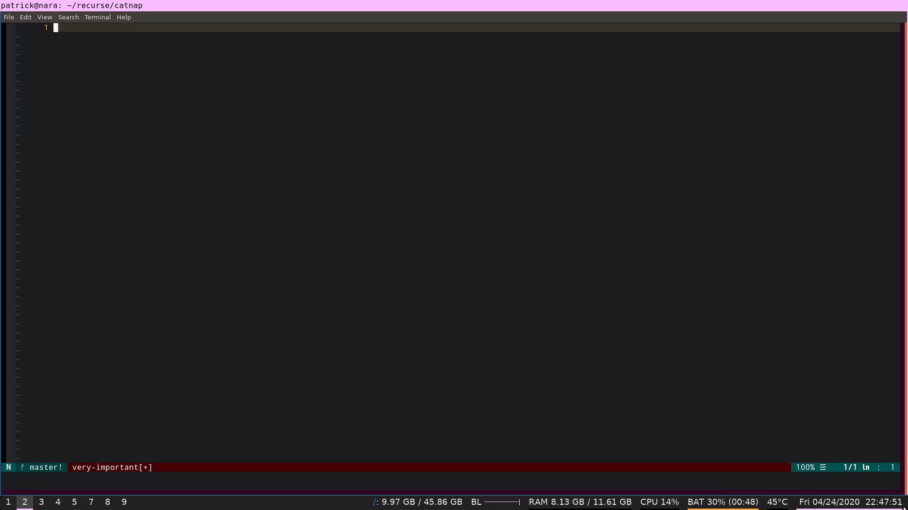

## 🐈 Catnap: Rest your eyes with napping cats (TODO: cats) 🐈

**Catnap** is an [Electron](https://www.electronjs.org/) app that periodically reminds you to rest your eyes.

[Read a blog post about it at cozy.computer](https://cozy.computer/catnap-app-part-one)



### Overview

The app is:
1. `catnap/app` - An `Electron` app written in `Javascript` that opens/closes a minimal full-screen `Chromium` browser window
2. `catnap/bin` - A Bash script that periodically launches the `Electron` app
3. `catnap/etc` - A `systemd` unit that runs the Bash script as a `daemon`

### Installation

**🐈Catnap🐈** depends on `npm` and uses `systemd/systemctl` - a system service manager for Linux.

Clone the repo, install Electron, and launch the app (the screen will fill and clear after 20 seconds):

```
git clone https://github.com/MerkleBros/catnap.git && cd catnap/app && npm install && npm start
```

### Usage

There are three ways to run the app:
1. Manually launch in `catnap/app` with `npm start`.
2. A Bash script `catnap/bin/catnap.sh` will launch the app every twenty minutes.
3. A `systemd` unit `catnap/etc/catnapd.service` can manage the Bash script with `systemctl`.

To use the `systemd` unit as a user unit, copy it to where `systemd` looks for unit files and reload `systemd` so that it finds the unit file. Then start the service and enable it on startup:

```
cp catnapd.service $HOME/.config/systemd/user && \
systemctl --user daemon-reload && \
systemctl --user start catnapd && \
systemctl --user enable catnapd
```

To stop the service and disable it on startup:

```
systemctl --user stop catnapd && \
systemctl --user disable catnapd
```

To remove the service from `systemd`;

```
rm $HOME/.config/systemd/user/catnapd.service && \
systemctl --user daemon-reload
```
